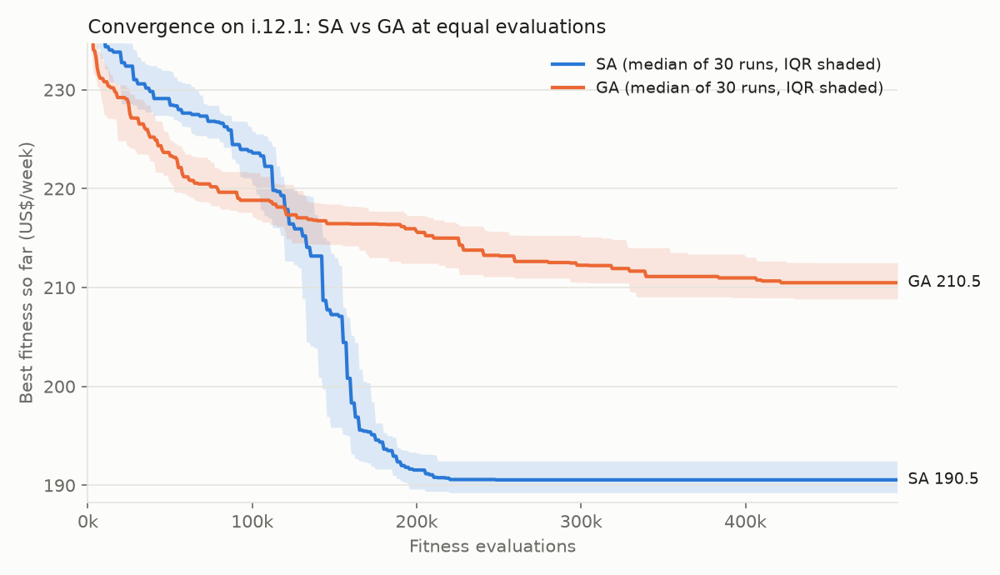
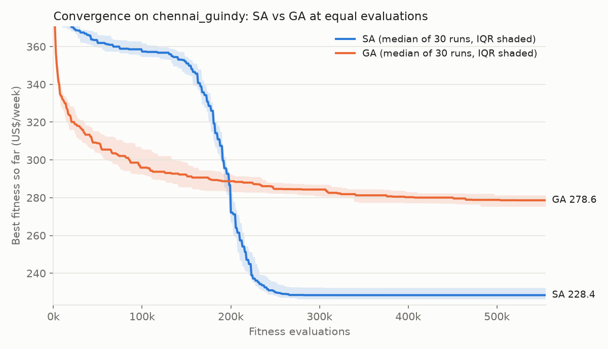

# Experiment summary

Each run is one seed; SA and GA are matched on fitness-function evaluations (see `results/calibration_*.txt`). All costs are per week, in each instance's own currency:

- **i.12.1**: US dollars (US$), the paper's own cost parameters.
- **chennai_guindy**: US dollars (US$), the paper's own cost parameters.

## Results by instance and algorithm

| Instance | Algo | n | Min | Median | Mean | 95% CI | Mean evals | Mean runtime (s) | All feasible |
|---|---|---|---|---|---|---|---|---|---|
| i.12.1 | SA | 30 | 186.47 US$ | 190.54 US$ | 190.77 US$ | [189.94 US$, 191.60 US$] | 445,583 | 41.6 | yes |
| i.12.1 | GA | 30 | 205.47 US$ | 210.48 US$ | 210.68 US$ | [209.52 US$, 211.84 US$] | 445,600 | 201.5 | yes |
| chennai_guindy | SA | 30 | 223.72 US$ | 228.38 US$ | 229.73 US$ | [228.02 US$, 231.44 US$] | 522,833 | 42.7 | yes |
| chennai_guindy | GA | 30 | 268.20 US$ | 278.61 US$ | 278.69 US$ | [276.28 US$, 281.10 US$] | 522,800 | 241.0 | yes |

Evaluation matching (GA vs mean SA evaluations):

- i.12.1: SA 445,583 (range 340,000–492,500), GA 445,600 → +0.00%
- chennai_guindy: SA 522,833 (range 460,000–555,000), GA 522,800 → -0.01%

## i.12.1 against the paper

Paper: Table 9 (SA, min 188.0 / mean 193.7) and Table 10 (MILP optimum, overall 178.42). Both sides in US$.

| Metric | Ours | Paper | Difference |
|---|---|---|---|
| SA min | 186.47 | SA min 188.0 | -0.81% |
| SA mean | 190.77 | SA mean 193.7 | -1.51% |
| SA min | 186.47 | MILP 178.42 | +4.51% |
| SA mean | 190.77 | MILP 178.42 | +6.92% |
| GA min | 205.47 | SA min 188.0 | +9.29% |
| GA mean | 210.68 | SA mean 193.7 | +8.76% |
| GA min | 205.47 | MILP 178.42 | +15.16% |
| GA mean | 210.68 | MILP 178.42 | +18.08% |

## SA vs GA: Mann-Whitney U test (overall cost, two-sided)

| Instance | n (SA, GA) | U | p-value | Median SA | Median GA | Verdict (α = 0.05) |
|---|---|---|---|---|---|---|
| i.12.1 | 30, 30 | 0.0 | 3.02e-11 | 190.54 US$ | 210.48 US$ | significant — SA lower |
| chennai_guindy | 30, 30 | 0.0 | 3.02e-11 | 228.38 US$ | 278.61 US$ | significant — SA lower |

## chennai_guindy: cost breakdown (USD)

| Algo | | Bin cost | Routing cost | Overall |
|---|---|---|---|---|
| SA | mean | 73.51 US$ | 156.22 US$ | 229.73 US$ |
| SA | median | 73.22 US$ | 154.92 US$ | 228.38 US$ |
| SA | best (seed 28) | 69.89 US$ | 153.83 US$ | 223.72 US$ |
| GA | mean | 77.79 US$ | 200.90 US$ | 278.69 US$ |
| GA | median | 77.55 US$ | 200.87 US$ | 278.61 US$ |
| GA | best (seed 27) | 79.85 US$ | 188.35 US$ | 268.20 US$ |

## Convergence

Median best fitness over all seeds against evaluations spent; the shaded band is the interquartile range. A run that stopped early holds its final value. The y-axis starts after the first 5% of the budget, where penalised infeasible starts would flatten the scale.

## Notes for reading these results

- The MILP value (Table 10) is the proven optimum for i.12.1, so the "vs MILP" rows are optimality gaps. Only SA and MILP figures from the paper are compared here.
- A Mann-Whitney U of 0 means complete separation: every SA run beat every GA run. With 30 runs each, that gives the same p-value (normal approximation) on both instances.
- Evaluations are matched, wall time is not. GA's crossover, mutation and repair are pure Python, while the decoder is compiled, so GA takes ~5× longer for the same number of evaluations. Runtimes were measured with 11 runs in parallel, which is about 4× slower per run than running alone.
- SA's evaluation count varies by seed because it stops after 100 non-improving temperature steps. GA's generations were set from the 30-run SA mean (see `overnight_log.md`).

