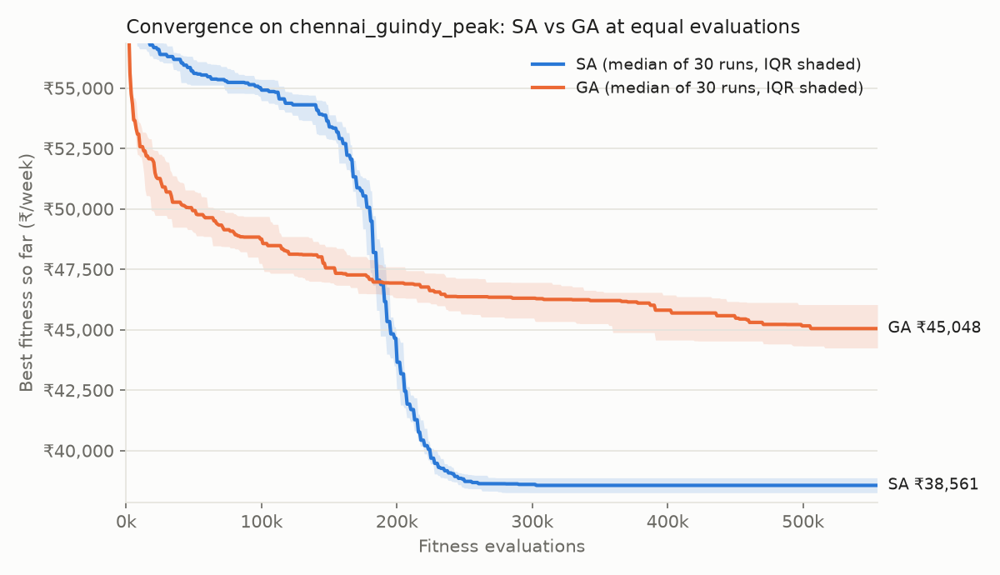

# Experiment summary

Each run is one seed; SA and GA are matched on fitness-function evaluations (see `results/calibration_*.txt`). All costs are per week, in each instance's own currency:

- **i.12.1**: US dollars (US$), the paper's own cost parameters.
- **chennai_guindy**: Indian rupees (₹). These figures are an FX conversion of the paper's US$ cost parameters at 96.3789 ₹/US$, **not** independently sourced Indian rates.
- **chennai_guindy_peak**: Indian rupees (₹). These figures are an FX conversion of the paper's US$ cost parameters at 96.3789 ₹/US$, **not** independently sourced Indian rates.

## Results by instance and algorithm

| Instance | Algo | n | Min | Median | Mean | 95% CI | Mean evals | Mean runtime (s) | All feasible |
|---|---|---|---|---|---|---|---|---|---|
| i.12.1 | SA | 30 | 186.47 US$ | 190.54 US$ | 190.77 US$ | [189.94 US$, 191.60 US$] | 445,583 | 41.6 | yes |
| i.12.1 | GA | 30 | 205.47 US$ | 210.48 US$ | 210.68 US$ | [209.52 US$, 211.84 US$] | 445,600 | 201.5 | yes |
| chennai_guindy | SA | 30 | ₹29,250.84 | ₹30,014.38 | ₹30,079.05 | [₹29,941.63, ₹30,216.48] | 522,000 | 230.3 | yes |
| chennai_guindy | GA | 30 | ₹33,597.28 | ₹34,910.32 | ₹34,954.69 | [₹34,679.51, ₹35,229.86] | 522,000 | 595.4 | yes |
| chennai_guindy_peak | SA | 30 | ₹37,378.69 | ₹38,560.64 | ₹38,546.95 | [₹38,368.87, ₹38,725.03] | 517,333 | 101.1 | yes |
| chennai_guindy_peak | GA | 30 | ₹43,256.16 | ₹45,048.30 | ₹45,198.75 | [₹44,806.82, ₹45,590.67] | 517,300 | 518.6 | yes |

Evaluation matching (GA vs mean SA evaluations):

- i.12.1: SA 445,583 (range 340,000–492,500), GA 445,600 → +0.00%
- chennai_guindy: SA 522,000 (range 490,000–550,000), GA 522,000 → +0.00%
- chennai_guindy_peak: SA 517,333 (range 467,500–555,000), GA 517,300 → -0.01%

## i.12.1 against the paper

Paper: Table 9 (SA, min 188.0 / mean 193.7) and Table 10 (MILP optimum, overall 178.42). Both sides in US$.

| Metric | Ours | Paper | Difference |
|---|---|---|---|
| SA min | 186.47 | SA min 188.0 | -0.81% |
| SA mean | 190.77 | SA mean 193.7 | -1.51% |
| SA min | 186.47 | MILP 178.42 | +4.51% |
| SA mean | 190.77 | MILP 178.42 | +6.92% |
| GA min | 205.47 | SA min 188.0 | +9.29% |
| GA mean | 210.68 | SA mean 193.7 | +8.76% |
| GA min | 205.47 | MILP 178.42 | +15.16% |
| GA mean | 210.68 | MILP 178.42 | +18.08% |

## SA vs GA: Mann-Whitney U test (overall cost, two-sided)

| Instance | n (SA, GA) | U | p-value | Median SA | Median GA | Verdict (α = 0.05) |
|---|---|---|---|---|---|---|
| i.12.1 | 30, 30 | 0.0 | 3.02e-11 | 190.54 US$ | 210.48 US$ | significant — SA lower |
| chennai_guindy | 30, 30 | 0.0 | 3.02e-11 | ₹30,014.38 | ₹34,910.32 | significant — SA lower |
| chennai_guindy_peak | 30, 30 | 0.0 | 3.02e-11 | ₹38,560.64 | ₹45,048.30 | significant — SA lower |

## chennai_guindy: cost breakdown (INR)

| Algo | | Bin cost | Routing cost | Overall |
|---|---|---|---|---|
| SA | mean | ₹7,526.58 | ₹22,552.47 | ₹30,079.05 |
| SA | median | ₹7,485.75 | ₹22,607.77 | ₹30,014.38 |
| SA | best (seed 16) | ₹6,696.41 | ₹22,554.44 | ₹29,250.84 |
| GA | mean | ₹8,020.17 | ₹26,934.51 | ₹34,954.69 |
| GA | median | ₹8,019.21 | ₹27,027.55 | ₹34,910.32 |
| GA | best (seed 15) | ₹8,277.98 | ₹25,319.30 | ₹33,597.28 |

## chennai_guindy_peak: cost breakdown (INR)

| Algo | | Bin cost | Routing cost | Overall |
|---|---|---|---|---|
| SA | mean | ₹7,994.12 | ₹30,552.84 | ₹38,546.95 |
| SA | median | ₹8,034.15 | ₹30,556.54 | ₹38,560.64 |
| SA | best (seed 20) | ₹7,998.48 | ₹29,380.21 | ₹37,378.69 |
| GA | mean | ₹7,965.91 | ₹37,232.84 | ₹45,198.75 |
| GA | median | ₹8,031.25 | ₹37,186.21 | ₹45,048.30 |
| GA | best (seed 18) | ₹8,064.02 | ₹35,192.14 | ₹43,256.16 |

## Chennai: free-flow vs peak-hour traffic

The peak scenario multiplies every OSRM travel time by 1.5. Both use the same points, depot, bins and rupee cost parameters. Under Eq. (10) the shift limit TL is derived from the travel-time matrix, so it grows with traffic too (96 → 144 min).

Best solution per scenario (`chennai_guindy_sa_seed16` and `chennai_guindy_peak_sa_seed20`), plus the 30-run SA mean:

| | Free-flow | Peak (×1.5) | Change |
|---|---|---|---|
| Overall cost (best) | ₹29,250.84 | ₹37,378.69 | +27.79% |
| Bin cost (best) | ₹6,696.41 | ₹7,998.48 | +19.44% |
| Routing cost (best) | ₹22,554.44 | ₹29,380.21 | +30.26% |
| Overall cost (SA mean of 30) | ₹30,079.05 | ₹38,546.95 | +28.15% |
| Routes per week | 7 | 7 | +0.00% |
| Total route time (min) | 406.0 | 528.9 | +30.26% |
| Longest route (min) | 68.7 | 84.5 | +22.90% |
| Shift limit TL (min) | 96 | 144 | +50.00% |
| Longest route / TL | 72% | 59% | |
| Feasible | yes | yes | |

Bin combinations are different in the two best solutions (9 of 21 points differ).

## Convergence

Median best fitness over all seeds against evaluations spent; the shaded band is the interquartile range. A run that stopped early holds its final value. The y-axis starts after the first 5% of the budget, where penalised infeasible starts would flatten the scale.

## Notes for reading these results

- The MILP value (Table 10) is the proven optimum for i.12.1, so the "vs MILP" rows are optimality gaps. Only SA and MILP figures from the paper are compared here.
- A Mann-Whitney U of 0 means complete separation: every SA run beat every GA run. With 30 runs each, every instance with complete separation gets the same p-value (normal approximation).
- Evaluations are matched, wall time is not. GA's crossover, mutation and repair are pure Python, while the decoder is compiled, so GA takes ~5× longer for the same number of evaluations. Runtimes were measured with 11 runs in parallel, which is about 4× slower per run than running alone.
- SA's evaluation count varies by seed because it stops after 100 non-improving temperature steps. GA's generations were set from the 30-run SA mean (see `overnight_log.md`).
- The Chennai runs (2026-10-02) ran on battery power, so the CPU was throttled by varying amounts. Their runtimes are not comparable with i.12.1's or with each other; evaluation counts are the fair measure of effort.
- Rupee figures are the paper's US$ cost parameters converted at 96.3789 ₹/US$ (mid-market, 2026-10-02, https://open.er-api.com/v6/latest/USD). The penalty weights and SA's final temperature are converted too, so the optimisation problem is the same as in US$. Locally sourced Greater Chennai Corporation rates would change the bin-vs-routing tradeoff, not just the totals.

